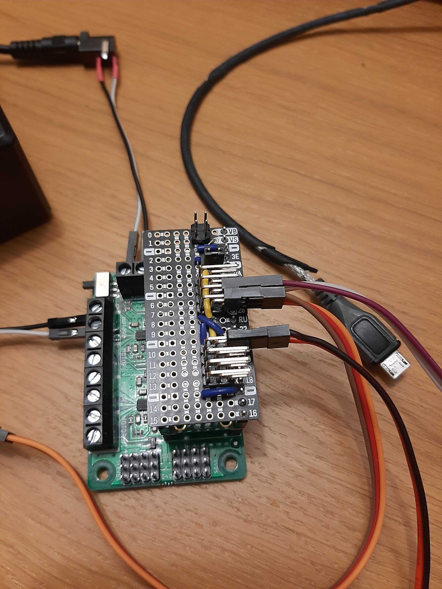

# Guard

> The guard is the person responsible for the safe operation of a train - including bringing it to an emergency stop if required.

This is a semi-automatic motor driver Pico that can controlled over UDP (see [rp2-fire-and-ice](../rp2-fire-and-ice)) and by sensors.

<video controls src="media/demo-compressed.mp4" title="Guard demonstration"></video>
_Demonstration of Guard in automatic mode during development - note the laser position sensors activating as the train passes by_

Guard has two primary modes of operation: manual and automatic. In manual mode, it will set the speed and direction of the train's motor based on what it is commanded over WiFi.
Pressing the attached (emergency) stop button will halt the train.
A second press will put Guard into automatic mode where it will accelerate the train to a maximum speed, wait for the sensor to trigger, stop the train and reverse direction - before repeating the process.
While in automatic mode, position sensor feedback will be sent to the Fire and Ice controller, which can also command an emergency stop.

## Hardware

- Pico W (a Pico 2 W should work just as well)
- Kitronic Simple Robotics board
- 2x Laser Time of Flight Sensors
- Momentary push-button switch
- 12V 1A Power-Supply

Much of which can be sourced from https://thepihut.com/

_The assembled hardware, with custom signal-distribution board, ready for mounting to a baseboard_

## Pico Pinouts

- Motor 0 - Coreless Motor
- GPIO 21 - Stop Button
- GPIO 26 - Rev Sensor
- GPIO 27 - Fwd Sensor
- GPIO 16 - Speed Indicator LED (used during development, LED not included in final build)

## Operation

A state machine is used to control the operation of Guard, these are defined in [stately.py](stately.py) and implemented in [main.py](main.py).

States:

- INITIALISE - Starting state, powers up electrical components
- CONNECT - Perform WiFI connection
- STOP - Bring train to a stop
- MANUAL - Handle manual control
- FORWARD - Move the train forward at a maximum speed
- REVERSE - Move the train backwards at a maximum speed
- SLOW - Slow to a stop, triggered by a position sensor
- WAIT - Wait a random amount of time between 1 and 7 seconds
- BOUNCE - Change direction
- ERROR - Handles unexpected Python errors and hardware errors
- SHUTDOWN - Graceful shutdown

State transitions:

